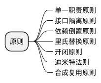
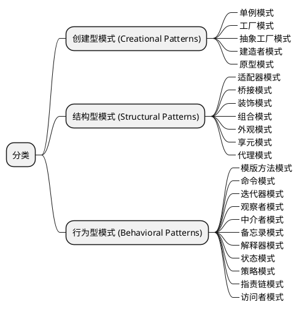

# Overview

## 设计模式原则

```plantuml
@startmindmap
* 原则
 *_ 单一职责原则
 *_ 接口隔离原则
 *_ 依赖倒置原则
 *_ 里氏替换原则
 *_ 开闭原则
 *_ 迪米特法则
 *_ 合成复用原则
@endmindmap
```

## 设计模式分类

```plantuml
@startmindmap
* 分类
 * 创建型模式 (Creational Patterns)
  *_ 单例模式
  *_ 工厂模式
  *_ 抽象工厂模式
  *_ 建造者模式
  *_ 原型模式
 * 结构型模式 (Structural Patterns)
  *_ 适配器模式
  *_ 桥接模式
  *_ 装饰模式
  *_ 组合模式
  *_ 外观模式
  *_ 享元模式
  *_ 代理模式
 * 行为型模式 (Behavioral Patterns)
  *_ 模版方法模式
  *_ 命令模式
  *_ 迭代器模式
  *_ 观察者模式
  *_ 中介者模式
  *_ 备忘录模式
  *_ 解释器模式
  *_ 状态模式
  *_ 策略模式
  *_ 指责链模式
  *_ 访问者模式
@endmindmap
```
