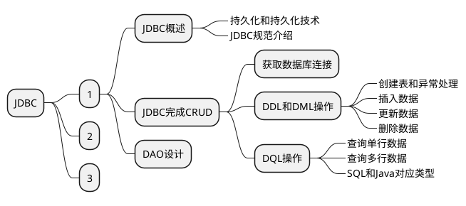

# Overview

```plantuml
@startmindmap
* JDBC
** 1
*** JDBC概述
****_ 持久化和持久化技术
****_ JDBC规范介绍
*** JDBC完成CRUD
**** 获取数据库连接
**** DDL和DML操作
*****_ 创建表和异常处理
*****_ 插入数据
*****_ 更新数据
*****_ 删除数据
**** DQL操作
*****_ 查询单行数据
*****_ 查询多行数据
*****_ SQL和Java对应类型
*** DAO设计
** 2

** 3
@endmindmap
```
