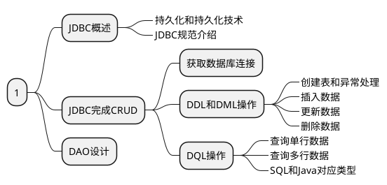

# 第一部分



## 1 JDBC概述

### 1.1 持久化和持久化技术

#### 1.1.1 什么是持久化

持久化(persistence)：把数据保存到可掉电存储设备中以供之后使用。
持久化的主要应用是将内存中的数据存储在关系型数据库中，当然也可以存储在磁盘文件、XML数据文件中。

#### 1.1.2 持久化技术

> JPA：JavaEE规范，Java Persistence API
> 在Java中，数据库存取技术**只能**通过JDBC访问数据库。

JDBC访问数据库的形式主要有两种：

1. 直接使用JDBC的API去访问数据库服务器
1. 间接地使用JDBC的API去访问数据库服务器
    1. 第三方O/R Mapping工具，如Hibernate，MyBatis等
    1. 本质都是对JDBC的封装

### 1.2 JDBC规范介绍

> JDBC(Java DataBase Connectivity)是一种用于执行SQL语句对Java API，可以为多种关系数据库提供统一访问，它由一组用Java语言编写对类和接口组成。

* JDBC版本：
JDBC隶属于JavaSE对范畴，伴随着JavaSE对版本升级。
Java6开始：JDBC4.0:新特性--无需加载注册驱动
Java6开始：JDBC4.1

* 注意：
在开发中，使用到关于JDBC的接口全部引入对是java.sql包中的

## 2 JDBC完成CRUD

### 2.1 获取数据库连接

操作JDBC第一步，获取JDBC的连接对象：Connection

1. 加载注册驱动：Class.forName("com.mysql.jdbc.Driver");
    1. 为什么上述这行代码就能完成加载和注册驱动操作呢？
    1. 会吧com.mysql.jdbc.Driver这份字节码加载进JVM
    1. 当一份字节码被加载进JVM时，就会执行该字节码中的静态代码块

    ```java
    public class Driver extends NonRegisteringDriver implements java.sql.Driver {
        // Register ourselves with the DriverManager
        static {
            try {
                java.sql.DriverManager.registerDriver(new Driver());
            } catch (SQLException E) {
                throw new RuntimeException("Can't register driver!");
            }
        }
        // ... ...
    }
    ```

1. 获取连接：
    1. 通过DriverManager类的getConnection方法来连接对象。
    2. ```Java Connection conn = DriverManager.getConnection("jdbc:mysql://localhost:3306/mybatis","root","root");```
    3. 通过使用MySQL命令```show processlist```检测数据库连接

* 简单了解
    从JDK1.6开始可以不需要手动加载注册驱动
    但是：必须手动给加载注册驱动，在JavaWeb中必须手动注册

### 2.2 DDL和DML操作

> 操作JDBC的步骤
>
> * 加载注册驱动
> * 获取连接对象
> * 创建语句对象
> * 执行SQL语句
> * 释放资源

* Connection接口：数据库的连接对象

```java
Statement createStatement(); //创建静态语句对象
```

* Statement接口：用于执行静态SQL的语句对象，用于把SQL语句发送到数据库中去执行，并返回执行之后到结果。
对于DQL：返回查询的结果集
对于DML：返回受影响的行数

#### 2.2.1 创建表和异常处理

* 创建表

```java
public void test() throws ClassNotFoundException, SQLException {
        String sql = "create table t_student (\n" +
                "    id bigint primary key auto_increment,\n" +
                "    name varchar(20),\n" +
                "    age int(11)\n" +
                ");";

        Class.forName("com.mysql.cj.jdbc.Driver");

        Connection conn = DriverManager.getConnection("jdbc:mysql://localhost:3306/mybatis","root","root");

        Statement st = conn.createStatement();
        int row = st.executeUpdate(sql);

        st.close();
        conn.close();
        System.out.println(row);
    }
```

* 异常处理

```java
public void test() {
    String sql = "create table t_student (\n" +
                "    id bigint primary key auto_increment,\n" +
                "    name varchar(20),\n" +
                "    age int(11)\n" +
                ");";
    Connection conn = null;
    Statement st = null;
    try {
        Class.forName("com.mysql.cj.jdbc.Driver");
        conn = DriverManager.getConnection("jdbc:mysql://localhost:3306/mybatis","root","root");
        st = conn.createStatement();
        int row = st.executeUpdate(sql);
    } catch (Exception e) {
    } finally {
        try {
            if( st != null ) {
                st.close();
            }
        } catch (Exception e) {
            e.printStackTrace();
        } finally {
            try {
                if (conn != null) {
                    conn.close();
                }
            } catch (Exception e) {
                e.printStackTrace();
            }
        }
    }

    System.out.println(row);
}
```

#### 2.2.2 插入数据

#### 2.2.3 更新数据

#### 2.2.4 删除数据

### 2.3 DQL操作

#### 2.3.1 查询单行数据

#### 2.3.2 查询多行数据

#### 2.3.3 SQL和Java对应类型

## 3 DAO设计
