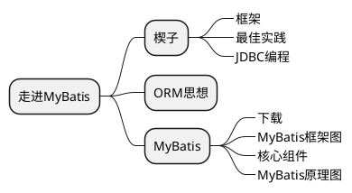

# 走进MyBatis



## 1 楔子

### 1.1 框架

> 框架：
>
> 1. 是一系列jar包，其本质是对JDK功能对拓展。
> 2. 框架是一组程序的集合，包含了一系列的最佳实现，作用是解决某一领域的问题

### 1.2 最佳实践

Web开发中的最佳实践：根据职责的纵向划分：控制层、业务层、持久层

* 控制层：web        负责与界面交互的相关操作(SpringMVC)
* 业务层：service    负责复杂的业务逻辑计算和判断(Spring)
* 持久层：dao        负责将业务逻辑数据进行持久化存储(MyBatis)

```plantuml
@startuml

@enduml
```

### 1.3 JDBC

```Java
public class DbUtil {
    public static final String URL = "jdbc:mysql://localhost:3306/imooc";
    public static final String USER = "jack";
    public static final String PASSWORD = "123456";
    private static Connection conn = null;
    static {
        try {
            //1.加载驱动程序
            Class.forName("com.mysql.jdbc.Driver");
            //2. 获得数据库连接
            conn = DriverManager.getConnection(URL, USER, PASSWORD);
        } catch (ClassNotFoundException e) {
            e.printStackTrace();
        } catch (SQLException e) {
            e.printStackTrace();
        }
    }
    public static Connection getConnection() {
        return conn;
    }
}

public class Test {
    @Test
    public void QueryTest() {
        Connection conn = DbUtil.getConnection();
        //sql, 每行加空格
        String sql = "select * from  t_people where id=?";
        //预编译SQL，减少sql执行
        PreparedStatement ps = conn.prepareStatement(sql);
        //传参
        ps.setInt(1, id);
        //执行
        ResultSet rs = ps.executeQuery()
        System.out.print(rs);
    }
}
```

## 2 ORM思想

对象关系映射(Object Relational Mapping)：
是一种为了解决面对对象与关系型数据库存在的互不匹配的问题的技术。

### 2.1 ORM主要解决==对象-关系的映射==

|面对对象概念|面对关系概念|
|--|--|
|类|表|
|对象|表的行(记录)|
|属性|表的列(字段)|

```xml
<?xml version="1.0" encoding="UTF-8"?>
<!DOCTYPE configuration PUBLIC "-//mybatis.org//DTD Config 3.0//EN"
<mapper namespace="com.demo">
    <resultMap type="User" id="resultPostsMap">
        <id column="t_id" property="id" />
        <result column="t_title" property="title" />
        <result column="t_content" property="content" />
    </resultMap>
</mapper>
```

### 2.2 目前流行的ORM框架

1. JPA： 本身是一种ORM规范，不是ORM框架，由各大ORM框架提供实现
1. Hibernate：之前最流行的ORM框架，设计灵巧、性能优越、文档丰富
1. MyBatis：目前是最受欢迎的持久层解决方案

## 3 MyBatis

> MyBatis是支持普通SQL查询，存储过程和高级映射的持久层框架，严格来是一个SQL映射框架。

### 3.1 下载

### 3.2 MyBatis框架图

### 3.3 核心组件

### 3.4 MyBatis原理图
